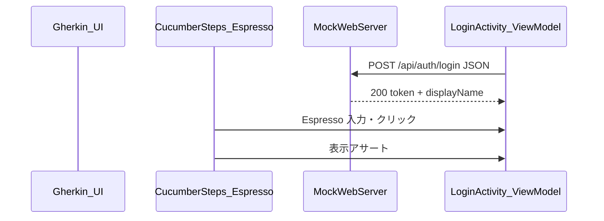

# Cucumber + Espresso + モック API によるログイン ATDD

## 現状の整理

- [app/build.gradle.kts](../app/build.gradle.kts): Cucumber は **JVM の `test` のみ**（`testImplementation`）。Espresso は `androidTestImplementation` のみで `src/androidTest` は未作成。
- 既存の Feature: [app/src/test/resources/features/login.feature](../app/src/test/resources/features/login.feature)（ユースケース／インメモリ Repo）、[login_api.feature](../app/src/test/resources/features/login_api.feature)（**MockWebServer** で HTTP 検証）。
- ドメインは `LoginRequest(email, password)` と JSON の `email` フィールド（[AuthApiClient.kt](../app/src/main/kotlin/com/example/atdd/auth/AuthApiClient.kt)）。**ログイン識別子はメールアドレス（`email`）のみ**（既存コードと一致）。

**モックサーバ**: Android の instrumented テストではテストコードと同一プロセスで動かす **MockWebServer**（既採用）が現実的です。WireMock は JVM 向けが主で、エミュレータ上ではセットアップが重くなりがちです。要件上「Wiremock でもなんでも」であれば **MockWebServer を継続**し、スタブで「登録済みユーザ＋認証成功時に表示名を返す」JSON を返す形にします。

## アーキテクチャ（データの流れ）



## 1. ドメイン・API 契約の拡張（email のまま）

- `LoginRequest` は **`email` + `password` を維持**（リネームしない）。
- [LoginUseCase.kt](../app/src/main/kotlin/com/example/atdd/auth/LoginUseCase.kt): 既存の「メールアドレスを入力してください」等のバリデーションを維持。
- [AuthApiClient.kt](../app/src/main/kotlin/com/example/atdd/auth/AuthApiClient.kt): リクエスト JSON は引き続き `email` / `password`。成功レスポンスに **`displayName`（表示名）** を含める想定でパース（例: `token` と `displayName`）。既存の `token` のみ `Success` にしている部分を拡張。
- [LoginResult.kt](../app/src/main/kotlin/com/example/atdd/auth/LoginResult.kt): 成功時に **表示名** を保持できるよう `Success` を拡張（トップ画面表示用）。
- **既存の JVM テスト**（[LoginSteps.kt](../app/src/test/kotlin/com/example/atdd/steps/LoginSteps.kt) のインメモリ Repo、[LoginApiSteps.kt](../app/src/test/kotlin/com/example/atdd/steps/LoginApiSteps.kt) の MockWebServer）は、必要に応じて **200 レスポンスに `displayName` を追加**するなど最小限の更新にとどめる（`login.feature` のステップ文言はメールアドレスのまま）。

## 2. UI 実装（Espresso の操作対象）

最小構成の例（名前はプロジェクトに合わせて調整）:

- **ログイン画面**（`LoginActivity` + layout）: **メールアドレス**・パスワードの `EditText`、ログインボタン（`android:id` を Espresso 用に明示）。識別子は **メールアドレスのみ**（別名の ID 入力は置かない）。
- **トップ画面**（既存 [MainActivity.kt](../app/src/main/kotlin/com/example/atdd/MainActivity.kt) を拡張、または `TopActivity`）: ログイン API 成功時に返る **表示名（`displayName`）** を出す `TextView`、ログアウトボタン。
- ログイン成功後にトップへ遷移（`Intent` で表示名を渡す、またはセッション用の `SharedPreferences` に保存して Main で読む）。ATDD では **表示結果が見えればよい**ため、どちらか一方に統一。
- [AndroidManifest.xml](../app/src/main/AndroidManifest.xml): ランチャーを **未ログイン時はログイン画面**にするのがシナリオと相性が良い（「Given 未ログイン」が自然）。ログアウト後は再びログイン画面へ。

## 3. instrumented Cucumber の Gradle 設定

- `androidTestImplementation` に **Cucumber Android**（`io.cucumber:cucumber-android`）を追加し、バージョンは既存の **cucumber-java 7.34.x 系と揃える**（解決できない場合は同一メジャーに揃える）。
- `androidTestImplementation` に **MockWebServer**（`mockwebserver3`）を追加（現状は `testImplementation` のみ）。
- `defaultConfig.testInstrumentationRunner` を `io.cucumber.android.runner.CucumberAndroidJUnitRunner`（実際のクラス名は依存ライブラリの README / メタデータで確認し、プロジェクトで 1 回ビルドして確定）に変更。
- Feature 配置: 慣例どおり `src/androidTest/assets/features/` に `.feature` を置き、`cucumber.properties`（またはランナー引数）で `features` / `glue` を指定。

参考: [cucumber-android（GitHub）](https://github.com/cucumber/cucumber-android)

## 4. 新規 Feature ファイル（ご希望の雰囲気）

`src/androidTest/assets/features/` に例（ファイル名の例: `login_ui.feature`）:

```gherkin
Feature: ログインからトップ表示まで
  メールアドレスとパスワードでログインし、トップに表示名とログアウトが表示される

  Scenario: 登録済みメールアドレスでログインするとトップに表示名とログアウトが表示される
    Given 未ログイン状態になっている
      And メールアドレス "test@example.com" がパスワード "pass123" で登録されている
    When メールアドレス "test@example.com" とパスワード "pass123" でログインする
    Then 表示名 "山田太郎" がトップページに表示されている
      And ログアウトボタンが表示されている
```

- 「登録されている」は **モック側の期待データ**（MockWebServer のディスパッチャで該当 `email` / `password` のとき 200、`displayName` は上記 Then と一致する値を返す）として実装。`Given` / `And` の「メールアドレス "..." がパスワード "..." で登録」の並びは、既存の [login.feature](../app/src/test/resources/features/login.feature) の「ユーザー "..." がパスワード "..." で登録」と同型で、語だけメールアドレスに寄せている。
- 「未ログイン」は `@Before` で SharedPreferences クリア、`ActivityScenarioRule` でログイン画面起動、などで担保。

## 5. Step 定義（`androidTest` 用パッケージ）

- 新パッケージ（例: `com.example.atdd.steps.ui`）に **Glue** を置き、`androidTest` ソースセットのみでコンパイル。シナリオ・ステップの引数は **メールアドレス文字列**（例: `test@example.com`）で統一する。
- Espresso: `onView(withId(...))`, `perform(typeText, click)`, `matches(isDisplayed())`。
- MockWebServer: `@Before` で起動し、**ベース URL をアプリに注入**する必要あり。実装パターンの候補:
  - **BuildConfig / manifest placeholder / `androidTest` のみの Application クラス**で `BASE_URL` を上書き（推奨: テスト用 `Application` または Hilt なしなら `IdlingResource` と合わせて `BuildConfig.API_BASE_URL` を `debug` と `androidTest` で分ける）。
  - シンプル案: `debug` ビルドで読む `res/values/strings.xml` のベース URL を、`androidTest` の `AndroidManifest` マージや `BuildConfig` でテスト時のみ `http://127.0.0.1:<port>/` に差し替え。

**重要**: エミュレータではループバックは `127.0.0.1` でテストプロセスとアプリが同一プロセスなら通常そのまま利用可能。実機のみ別途 `10.0.2.2` 等が必要な場合は README に一言。

## 6. 実行コマンド（実装後）

- `./gradlew :app:connectedDebugAndroidTest`（エミュレータ起動済み）

## リスク・注意

- **Cucumber Android のランナー完全修飾名**はライブラリバージョンで微妙に変わるため、追加後に一度ビルドログで確認する。
- Spotless / ktlint に引っかかる場合は既存スタイルに合わせてフォーマット。

## 主要タッチファイル（予定）

| 領域 | ファイル |
| --- | --- |
| Gradle | [app/build.gradle.kts](../app/build.gradle.kts) |
| Feature | `app/src/androidTest/assets/features/*.feature`（新規） |
| Glue | `app/src/androidTest/kotlin/.../steps/ui/*.kt`（新規） |
| Runner / 設定 | `CucumberAndroidJUnitRunner` 継承クラス、`cucumber.properties` またはマニフェスト（新規） |
| アプリ | `LoginActivity`、レイアウト、`MainActivity` 拡張、認証結果の受け渡し |
| 既存テスト整合 | `app/src/test/...` の feature / steps |
